# ExamenFinalCC-3S2

## Parte 1 

1. (1 punto)¿Cómo pueden los clientes encontrar microservicios y sus instancias?
A las instancias de microservicios normalmente se les asignan direcciones IP dinámicas cuando se inician, por ejemplo, cuando se ejecutan en contenedores. Esto dificulta que un cliente realice una solicitud a un microservicio que, por ejemplo, expone una API REST a través de HTTP. Considera el siguiente diagrama:

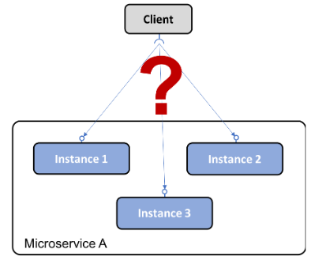

Se agrega un nuevo componente, un servicio de descubrimiento de servicios , al panorama del sistema, que realiza un seguimiento de los  microservicios disponibles actualmente y las direcciones IP de sus instancias. 

Para esto se necesita que:

* Se  registre/desregistre automáticamente los microservicios y sus instancias a medida que van y vienen.

* El cliente debe pueda realizar una solicitud a un extremo lógico para el microservicio. La solicitud se enrutará a una de las instancias disponibles de microservicios.

* Las solicitudes a un microservicio deben equilibrarse con la carga de las instancias disponibles.

* Debemos ser capaces de detectar instancias que actualmente no están en buen estado; es decir, las solicitudes no se enrutarán a ellos.

Y se puede implementar usando dos estrategias diferentes:

* Enrutamiento del lado del cliente: el cliente usa una biblioteca que se comunica con el servicio de descubrimiento de servicios para encontrar las instancias adecuadas para enviar las solicitudes.}

* Enrutamiento del lado del servidor: la infraestructura del servicio de detección de servicios también expone un proxy inverso al que se envían todas las solicitudes. El proxy inverso reenvía las solicitudes a una instancia de microservicio adecuada en nombre del cliente.

2. (2 puntos) En un entorno de sistema de microservicios, en muchos casos es deseable exponer
algunos de los microservicios al exterior del entorno del sistema y ocultar los microservicios
restantes del acceso externo. Los microservicios expuestos deben estar protegidos contra
solicitudes de clientes malintencionados.

Se agrega un nuevo componente, un  servidor perimetral , al entorno del sistema por el que pasarán todas las solicitudes entrantes  :

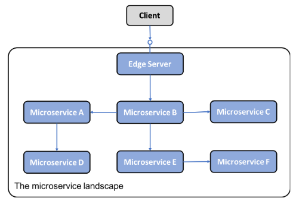

Un servidor perimetral normalmente se comporta como un proxy inverso y se puede integrar con un servicio de descubrimiento para proporcionar capacidades de equilibrio de carga dinámicas.

Para agregar esto se debe: 

* Ocultar servicios internos que no deben exponerse fuera de su contexto; es decir, enrutar solo solicitudes a microservicios que estén configurados para permitir solicitudes externas. 

* Exponer servicios externos y protegerlos de solicitudes maliciosas; es decir, use protocolos estándar y mejores prácticas como OAuth, OIDC, tokens JWT y claves API para garantizar que los clientes sean confiables.

3. (2 puntos) Tradicionalmente, como desarrolladores de Java, estamos acostumbrados a
implementar la comunicación sincrónica mediante el bloqueo de E/S, por ejemplo, una API
RESTful JSON sobre HTTP. El uso de una E/S de bloqueo significa que se asigna un subproceso
desde el sistema operativo durante la duración de la solicitud. Si aumentas la cantidad de
solicitudes simultáneas, un servidor podría quedarse sin subprocesos disponibles en el sistema
operativo, lo que provocaría problemas que van desde tiempos de respuesta más prolongados
hasta fallas en los servidores. El uso de una arquitectura de microservicios suele empeorar aún
más este problema, donde normalmente se utiliza una cadena de microservicios cooperativos
para atender una solicitud. Cuantos más microservicios participen en la atención de una
solicitud, más rápido se agotarán los subprocesos disponibles.

La solución es utilizar E/S sin bloqueo para asegurarse de que no se asignen subprocesos mientras espera que se produzca el procesamiento en otro servicio, es decir, una base de datos u otro microservicio.

Para esto antes debemos asegurar que:

* Siempre que sea factible, utilice un modelo de programación asincrónica; es decir, enviar mensajes sin esperar a que el receptor los procese.
* Si se prefiere un modelo de programación síncrona, asegúrese de que se utilicen marcos reactivos que puedan ejecutar solicitudes síncronas mediante E/S sin bloqueo, es decir, sin asignar un subproceso mientras se espera una respuesta. Esto hará que los microservicios sean más fáciles de escalar para manejar una mayor carga de trabajo.
* Los microservicios también deben estar diseñados para ser resilientes, es decir, capaces de producir una respuesta, incluso si falla un servicio del que depende. Una vez que el servicio defectuoso vuelve a estar operativo, sus clientes deben poder reanudar su uso, lo que se conoce como autorreparación.

4. (2 puntos) Tradicionalmente, una aplicación se implementa junto con su configuración, por
ejemplo, un conjunto de variables de entorno y/o archivos que contienen información de
configuración. Ante un panorama de sistemas basado en una arquitectura de microservicios, es
decir, con una gran cantidad de instancias de microservicios desplegadas, surgen algunas dudas:

* ¿Cómo obtengo una imagen completa de la configuración que existe para todas las
instancias de microservicio en ejecución?

* ¿Cómo actualizar la configuración y me aseguro de que todas las instancias de
microservicio afectadas se actualicen correctamente?

Agregue un nuevo componente, un servidor de configuración, al entorno del sistema para almacenar la configuración de todos los microservicios. 

Para esto debemos permitir almacenar información de configuración para un grupo de microservicios en un solo lugar, con diferentes configuraciones para diferentes entornos (por ejemplo, dev, test, QA y prod).

5. (3 puntos) Tradicionalmente, una aplicación escribe eventos logs en archivos logs que se
almacenan en el sistema de archivos local del servidor en el que se ejecuta la aplicación. Dado un
panorama de sistema basado en una arquitectura de microservicios, es decir, con una gran
cantidad de instancias de microservicios implementadas en una gran cantidad de servidores más
pequeños, podemos hacernos las siguientes preguntas:

* ¿Cómo se obtiene una descripción general de lo que sucede en el entorno del sistema
cuando cada instancia de microservicio escribe en su propio archivo log local?
* ¿Cómo averiguo si alguna de las instancias de microservicio tiene problemas y
comienza a escribir mensajes de error en sus archivos logs?
* Si los usuarios finales comienzan a informar problemas,¿cómo puedo encontrar
mensajes logs relacionados? es decir,¿cómo puedo identificar qué instancia de
microservicio es la causa raíz del problema? El siguiente diagrama ilustra el problema:

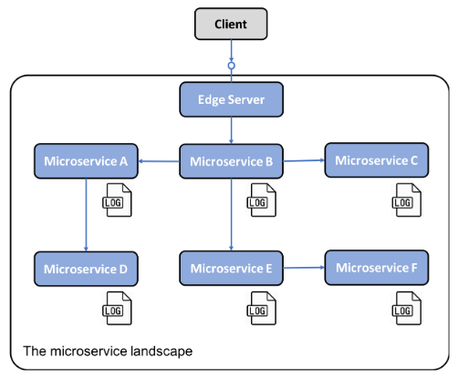

Se debe agregar un nuevo componente que pueda administrar el registro centralizado  y sea capaz de:

* Detectar nuevas instancias de microservicio y recopilar eventos de registro de ellas
* Interpretar y almacenar eventos de registro de forma estructurada y con capacidad de búsqueda en una base de datos central
* Proporcionar  API y  herramientas gráficas para consultar y analizar eventos de registro

6. (3 puntos) Debe ser posible rastrear solicitudes y mensajes que fluyen entre microservicios
mientras se procesa una solicitud externa al entorno del sistema. Algunos ejemplos de
escenarios de falla son los siguientes:

* Si los usuarios finales comienzan a presentar casos de soporte con respecto a una falla
específica,¿cómo podemos identificar el microservicio que causó el problema, es decir,
la causa raíz?
* Si un caso de soporte menciona problemas relacionados con una entidad específica, por
ejemplo, un número de pedido específico,¿cómo podemos encontrar mensajes de
registro relacionados con el procesamiento de este pedido específico, por ejemplo,
mensajes logs de todos los microservicios que estuvieron involucrados en su
procesamiento?
* Si los usuarios finales comienzan a presentar casos de soporte relacionados con un
tiempo de respuesta inaceptablemente largo,¿cómo podemos identificar qué
microservicio en una cadena de llamadas está causando la demora?

El siguiente diagrama representa esto:

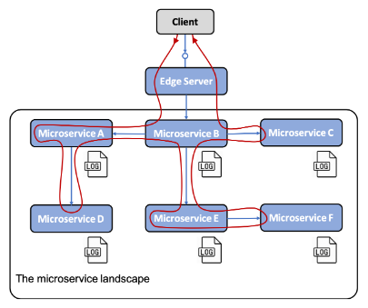

Para realizar un seguimiento del procesamiento entre los microservicios que cooperan, debemos asegurarnos de que todas las solicitudes y mensajes relacionados estén marcados con un ID de correlación común y que el ID de correlación sea parte de todos los eventos de registro. En función de un  ID de correlación, podemos usar el servicio de registro centralizado para encontrar todos los eventos de registro relacionados. Si uno de los eventos de registro también incluye información sobre un identificador relacionado con la empresa, por ejemplo, la identificación de un cliente, producto, pedido, etc., podemos encontrar todos los eventos de registro relacionados con ese identificador comercial utilizando la identificación de correlación.

Y para esto debemos:

* Asignar ID de correlación únicos a todas las solicitudes y eventos entrantes o nuevos en un lugar conocido, como un encabezado con un nombre reconocido.
* Cuando un microservicio realice una solicitud saliente o envie un mensaje, se debe agregar el  ID de correlación a la solicitud y al mensaje.
* Todos los eventos de registro deben incluir el ID de correlación en un formato predefinido para que el servicio de registro centralizado pueda extraer el ID de correlación del evento de registro y hacer que se pueda buscar.

## Parte 2

1. (0.5 puntos ) Ejecuta CouchDB como un contenedor de Docker y publica su puerto, de la siguiente manera:

a. Ejecuta el contenedor.

b. Publica el puerto de CouchDB.

c. Abre el navegador y verifica que CouchDB esté disponible

Basta con ejecutar el siiguiente comando: 

docker run -d -p 5984:5984 --name couchdb couchdb

y ahora vemos como si se creo el contenedor: 

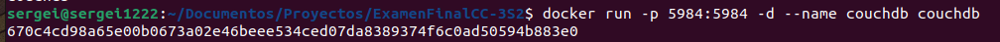

2. (1 punto) Crea una imagen de Docker con un servicio REST, respondiendo Hola Amigos CC-3S2 a localhost:8080/hola. Utiliza el lenguaje y el framework que prefieras. Estos son los pasos que debe seguir:

a. Crea una aplicación de servicio web.

b. Crea un Dockerfile para instalar dependencias y librerías.

c. Construye la imagen.

d. Ejecuta el contenedor que publica el puerto.

e. Verifica que se esté ejecutando correctamente utilizando el navegador (o curl).

Previamente cree una carpeta llamada flask donde cree los archivos hola.py y Dockerfile que de seguro podra ver en el repositorio en la carpeta flask.

Ejecute los siguientes comandos: 

docker build -t hola_with_flask .

docker run hola_with_flask

para luego ingresar en chrome el siguiente enlace: http://172.17.0.3:8080/hola y vemos como a funcionado : 

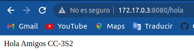

3. (1 punto) Crea un master de Jenkins y imágenes de agentes Docker y úsalos para ejecutar una infraestructura de Jenkins capaz de crear proyectos de Ruby:

a. Crea el Dockerfile del master de Jenkins, que instala automáticamente el complemento de Docker.

b. Crea la imagen master y ejecuta la instancia de Jenkins.

c. Crea el Dockerfile del agente (adecuado para el aprovisionamiento dinámico del
agente), que instala el intérprete de Ruby.

d. Crea la imagen del agente.

e. Cambia la configuración en la instancia de Jenkins para usar la imagen del agente.

Construiremos el maestro de Jenkins.

Para esto creamos los archivos executors.groovy y Dockerfile que estaran en la carpeta agent-master. Se establece el número de ejecutores en 5.

docker build -t sergei1222/jenkins-master .

docker push sergei1222/jenkins-master

Con esto se a creado la imagen sergei1222/jenkins-master y se a subido a docker hub:

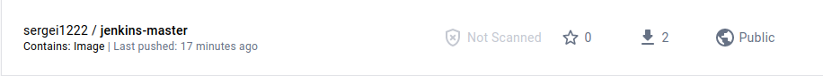

Ahora tocara crear la imágenes de agentes Docker con ruby.

Ahora se crea una carpeta llamada agente-ruby donde habra un archivo Dockerfile y luego ejecuto los siguientes comandos: 

docker build -t sergei1222/jenkins-agent-ruby .

con mi previo login ejecuto tambien: 

docker push sergei1222/jenkins-agent-ruby

y vemos que se a subido a docker hub: 

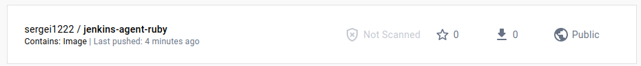

Por ultimo se cambia la configuración del agente en el maestro: el último paso, por supuesto, es configurar sergei1222/jenkins-agent-ruby en lugar de jenkins/agent en la configuración del maestro Jenkins .

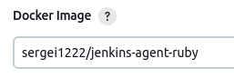

4. (1 punto) Crea un pipeline que ejecuta un script de Ruby que imprima Hola Mundo desde Ruby:

a. Crea un nuevo pipeline.

b. Utiliza el siguiente comando de shell para crear el script hola.rb sobre la marcha: sh "echo \"puts 'Hola Mundo en Ruby'\" > hola.rb"

c. Agregue el comando para ejecutar hola.rb , utilizando el intérprete de Ruby.

d. Ejecuta la construcción y observa la salida de la consola.

Procedemos a crear el piepline hola mundo ruby:

Ahora dentro de pipeline script creo un stage llamado hola mundo donde pondre los siguientes comandos:

sh "echo \"puts 'Hola Mundo en Ruby'\" > hola.rb"
                
sh "ruby hola.rb"

y eso seria todo mostraremos lo que sale en console output:

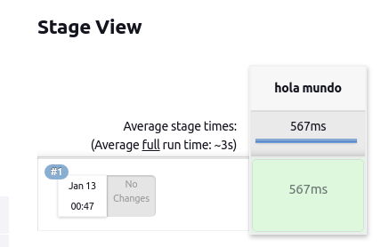

y aqui se ve como salio correctamente: 

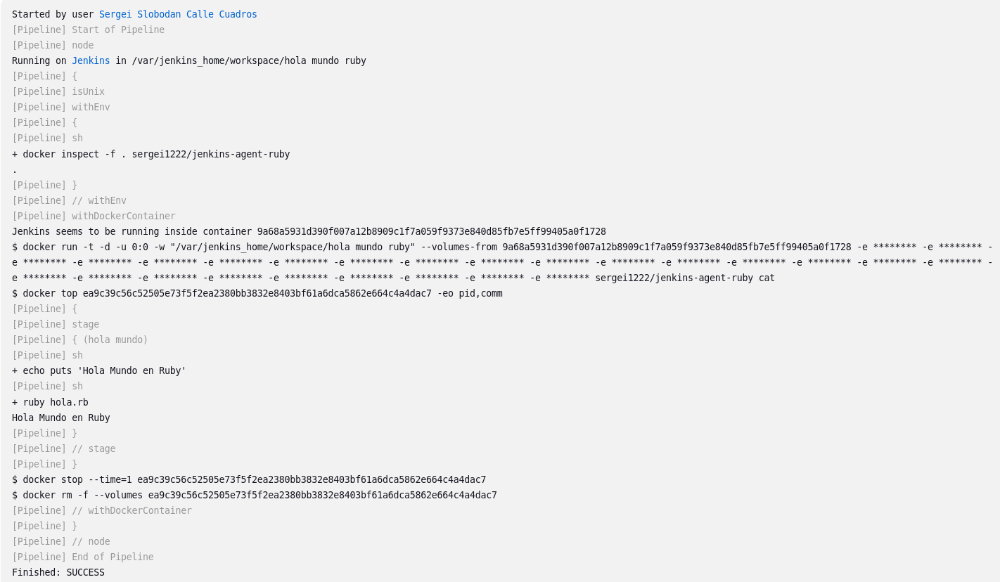

5. (1 punto) Crea un programa de Python que multiplique, sume, reste, divida dos números pasados como parámetros de línea de comandos. Agrega pruebas unitarias y publica el proyecto en GitHub:

a. Crea dos archivos:calculador.py y test_calculador.py.

b. Puedes usar la biblioteca unittest en https://docs.python.org/3/library/unittest.html.

c. Ejecuta el programa y la prueba unitaria.

6. (1 punto) Crea el pipeline de integración continua para el proyecto de calculadora de Python:

a. Usa Jenkinsfile para especificar el pipeline.

b. Configura el trigger para que el pipeline se ejecute automáticamente en caso de que se haga commit en el repositorio.

c. El pipeline no necesita el paso Compile ya que Python es un lenguaje interpretable.

d. Ejecuta el pipeline y observa los resultados.

e. Intenta hacer commit el código que rompe la construcción del pipeline y observa cómo se visualiza en Jenkins.

7. (0.5 puntos) Ejecuta una aplicación Hola Amigos CC-3S2 en el clúster de Kubernetes:
a. La aplicación Hola Amigos CC-3S2 puede verse exactamente igualmente al ejercicio 2

b. Implementa la aplicación con tres réplicas.

c. Exponga la aplicación con el servicio NodePort.

d. Realiza una solicitud (usando curl ) a la aplicación.

8. (1 punto) Implementa una nueva función, Nos vemos!, e implementa mediante una actualización continua:

a. Esta característica se puede agregar como un nuevo punto final, /bye , que siempre
devuelve Nos vemos!.

b. Reconstruye una imagen de Docker con una nueva etiqueta de versión.

c. Usa la estrategia RollingUpdate y readinessProbe

d. Observa el procedimiento de actualización continua.

e. Realiza una solicitud (usando curl) a la aplicación.